# 25. Part1

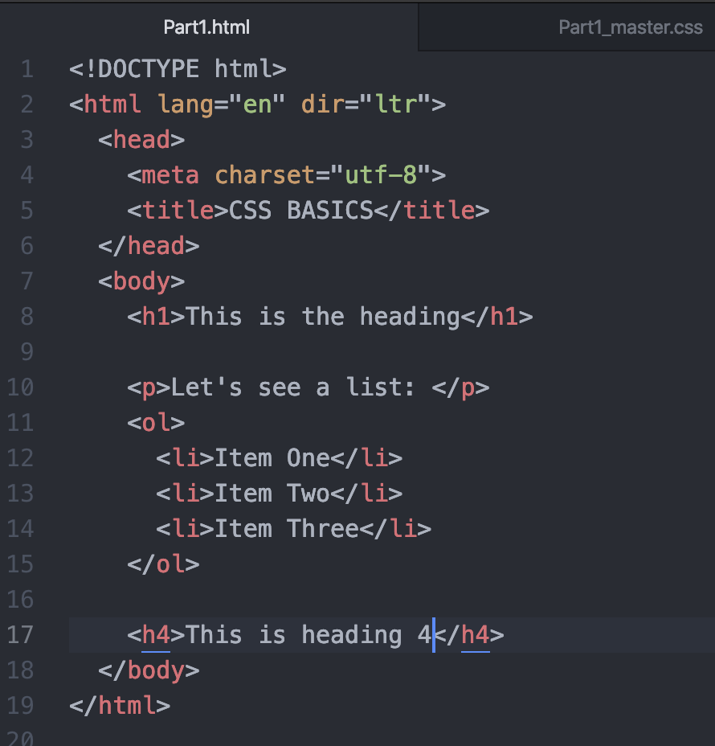

## link

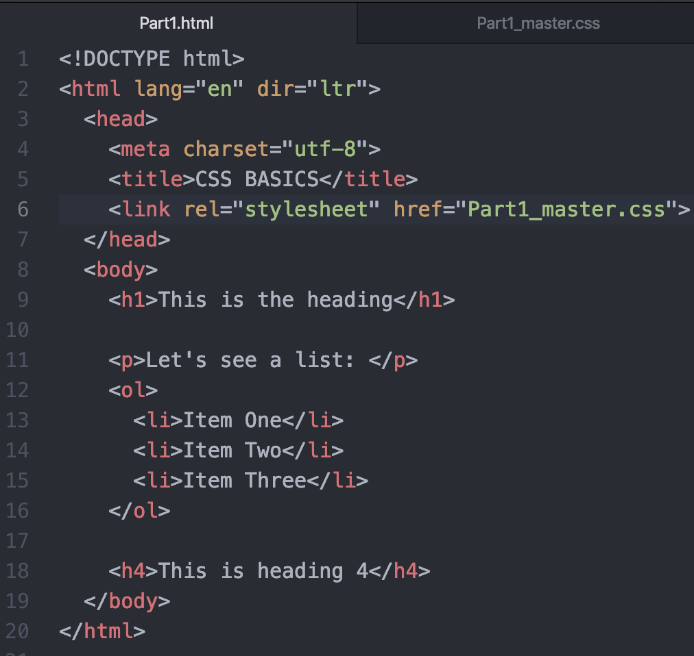

## tag{    ~     }

## color: blue;

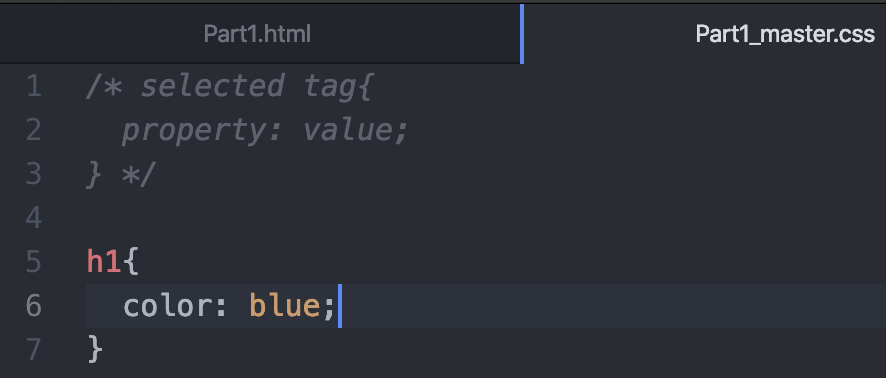

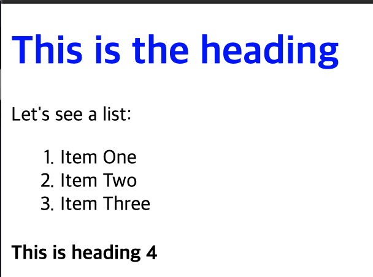

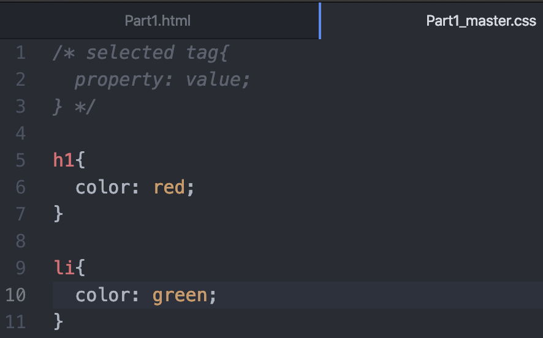

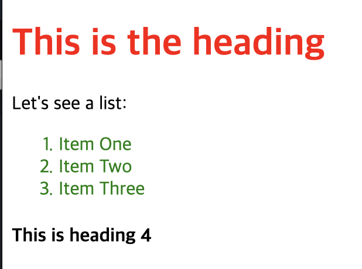

## color: rgb\(8, 84, 1\);

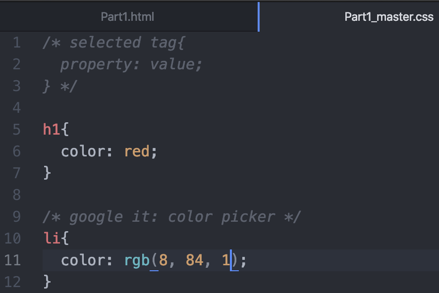

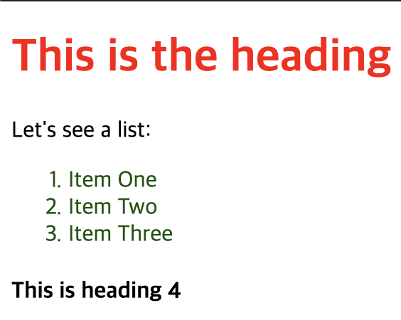

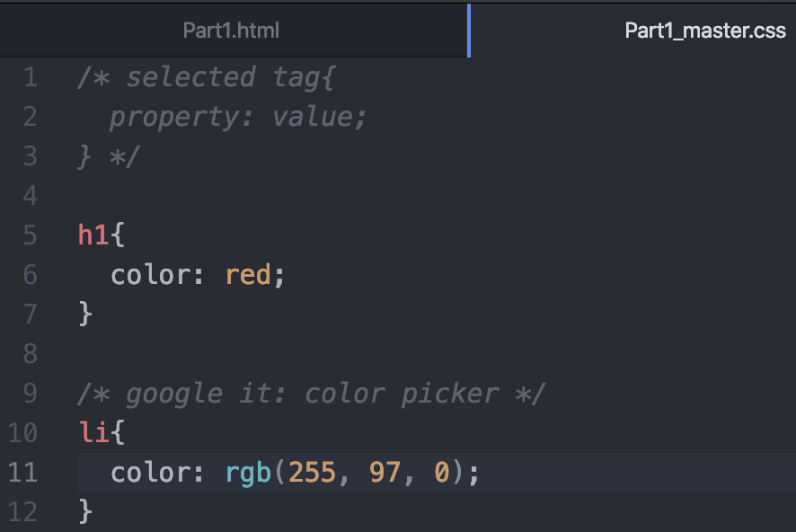

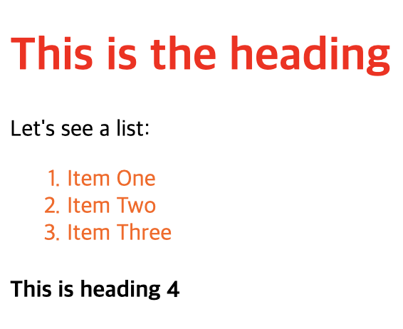

## Hex code

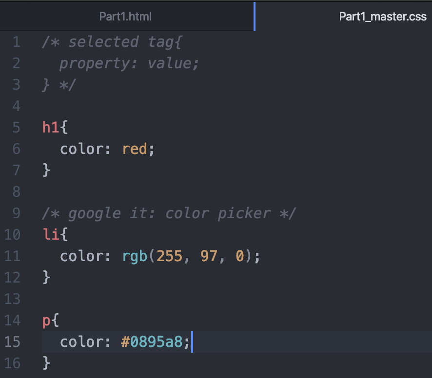

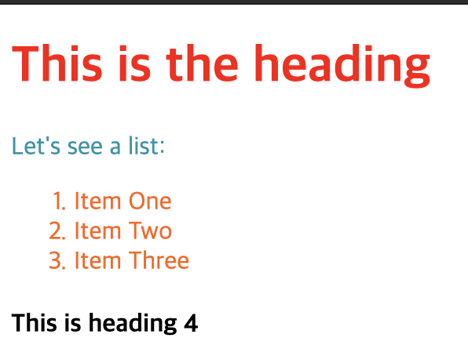

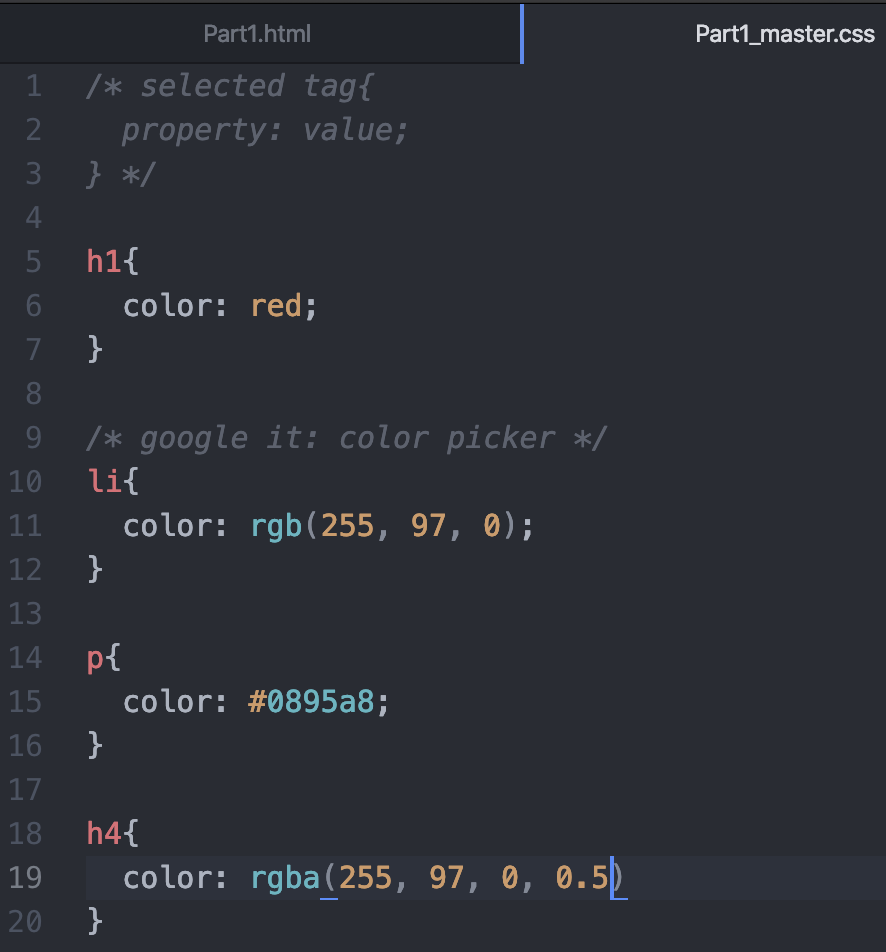

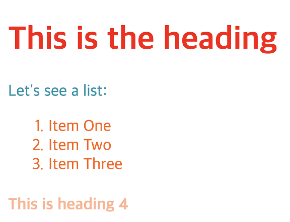

rgba stands for red, green, blue, alpha

* alpha value is between 0 and 1
* 0 -&gt; goes to transparent
* 1 -&gt; goes to darker

